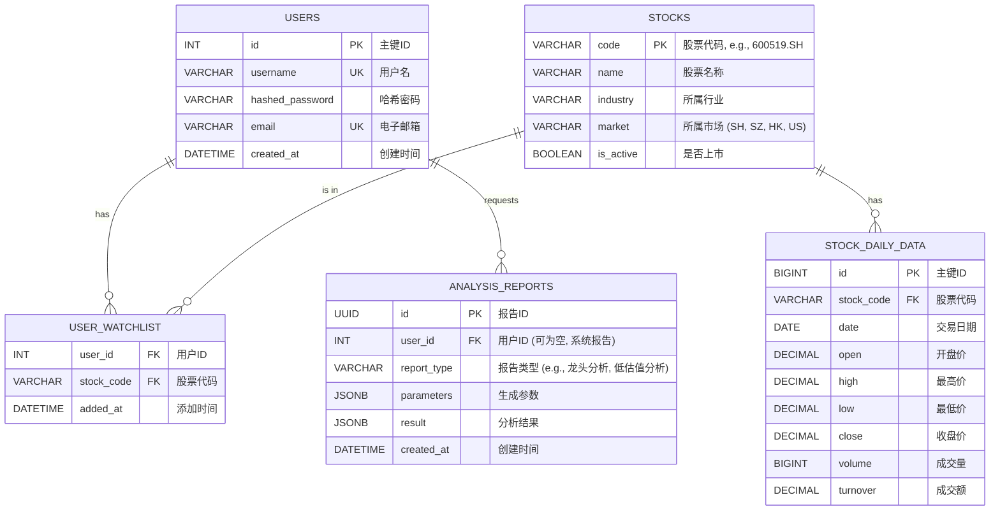

# 股票智能分析系统 - 数据库设计

## 1. 概述

本数据库设计旨在为“股票智能分析系统”提供一个结构化、可扩展的数据存储方案。生产环境选用`PostgreSQL`，开发环境使用`DuckDB`以简化部署。

设计遵循以下原则：
- **规范化**: 减少数据冗余，保证数据一致性。
- **可扩展性**: 方便未来增加新的数据表和字段。
- **查询效率**: 针对常用查询场景设计索引。

## 2. 数据表结构 (ERD)

## 3. 表详细设计

### 3.1. 用户表 (`users`)

存储用户信息。

| 字段名            | 数据类型          | 约束        | 中文注释         |
| ----------------- | ----------------- | ----------- | ---------------- |
| `id`              | `SERIAL`          | `PRIMARY KEY` | 主键ID (自增)    |
| `username`        | `VARCHAR(50)`     | `UNIQUE NOT NULL` | 用户名           |
| `hashed_password` | `VARCHAR(255)`    | `NOT NULL`  | 哈希处理后的密码 |
| `email`           | `VARCHAR(100)`    | `UNIQUE NOT NULL` | 电子邮箱         |
| `created_at`      | `TIMESTAMP WITH TIME ZONE` | `DEFAULT NOW()` | 账户创建时间     |

### 3.2. 股票信息表 (`stocks`)

存储所有关注市场的股票基本信息。

| 字段名       | 数据类型       | 约束        | 中文注释                                     |
| ------------ | -------------- | ----------- | -------------------------------------------- |
| `code`       | `VARCHAR(20)`  | `PRIMARY KEY` | 股票代码，全局唯一（例如 `600519.SH`） |
| `name`       | `VARCHAR(50)`  | `NOT NULL`  | 股票名称                                     |
| `industry`   | `VARCHAR(50)`  |             | 所属行业                                     |
| `market`     | `VARCHAR(10)`  | `NOT NULL`  | 所属市场 (例如: `SH`, `SZ`, `HK`, `US`)      |
| `is_active`  | `BOOLEAN`      | `DEFAULT TRUE` | 是否仍在上市交易                             |
| `updated_at` | `TIMESTAMP WITH TIME ZONE` | `DEFAULT NOW()` | 信息最后更新时间                             |

### 3.3. 股票日线数据表 (`stock_daily_data`)

存储股票的每日交易数据。

| 字段名       | 数据类型    | 约束            | 中文注释     |
| ------------ | ----------- | --------------- | ------------ |
| `id`         | `BIGSERIAL` | `PRIMARY KEY`   | 主键ID (自增) |
| `stock_code` | `VARCHAR(20)` | `FOREIGN KEY (stocks.code)` | 股票代码     |
| `date`       | `DATE`      | `NOT NULL`      | 交易日期     |
| `open`       | `DECIMAL(10, 2)` | `NOT NULL`      | 开盘价       |
| `high`       | `DECIMAL(10, 2)` | `NOT NULL`      | 最高价       |
| `low`        | `DECIMAL(10, 2)` | `NOT NULL`      | 最低价       |
| `close`      | `DECIMAL(10, 2)` | `NOT NULL`      | 收盘价       |
| `volume`     | `BIGINT`    | `NOT NULL`      | 成交量（股） |
| `turnover`   | `DECIMAL(20, 2)` | `NOT NULL`      | 成交额（元） |

**索引**: 在 `(stock_code, date)` 上创建复合唯一索引，防止重复数据。

### 3.4. 用户自选股表 (`user_watchlist`)

存储用户关注的股票列表，是`users`和`stocks`的多对多关系表。

| 字段名       | 数据类型          | 约束                               | 中文注释   |
| ------------ | ----------------- | ---------------------------------- | ---------- |
| `user_id`    | `INTEGER`         | `FOREIGN KEY (users.id)`           | 用户ID     |
| `stock_code` | `VARCHAR(20)`     | `FOREIGN KEY (stocks.code)`        | 股票代码   |
| `added_at`   | `TIMESTAMP WITH TIME ZONE` | `DEFAULT NOW()`                    | 添加时间   |

**主键**: `(user_id, stock_code)` 复合主键。

### 3.5. 分析报告表 (`analysis_reports`)

存储由系统或用户生成的分析报告结果，使用JSONB类型以获得灵活性。

| 字段名        | 数据类型          | 约束                     | 中文注释                                     |
| ------------- | ----------------- | ------------------------ | -------------------------------------------- |
| `id`          | `UUID`            | `PRIMARY KEY`            | 报告ID (使用UUID避免ID被猜测)                |
| `user_id`     | `INTEGER`         | `FOREIGN KEY (users.id)` | 关联的用户ID，若为系统报告则可为NULL       |
| `report_type` | `VARCHAR(50)`     | `NOT NULL`               | 报告类型 (例如: `dragon_head`, `undervalued`) |
| `parameters`  | `JSONB`           | `NOT NULL`               | 生成该报告时使用的参数                       |
| `result`      | `JSONB`           | `NOT NULL`               | 完整的分析结果                               |
| `created_at`  | `TIMESTAMP WITH TIME ZONE` | `DEFAULT NOW()`          | 报告创建时间                                 |

**索引**: 在 `(user_id)` 和 `(report_type)` 上创建索引，加速查询。
